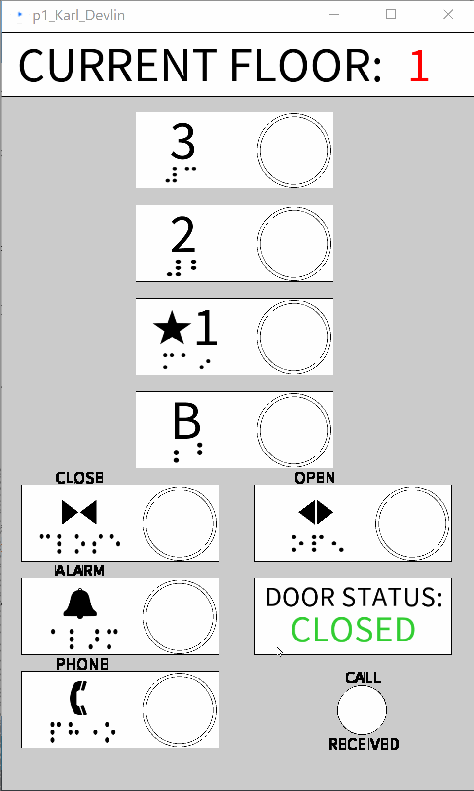

# Human Computer Interaction Prject 1
- This is a repo for Project 1 of CS 3366-002

Project requirements:
===

**To get a C, you need to:**
- [x] Find an elevator in the apartment/hotel/airport. Only one example for each student.
- [x] Take photos of the control interface

- [x] Show a gif image of the control interface in operation.

- [ ] Find the issues with the current design.
- [ ] Explain why it is good/bad.

**To get a B, you need to:**
- [ ] Think about the common things that you use an elevator. List your most common uses and other more rare uses. Does the interface make doing those common things easier?
- [ ] Think about how the user interacts with the elevator. What is the common sequence of actions?
- [ ] How does the elevator support the user to figure out how to make it work?
- [ ] How does the elevator provide feedback to the user?
- [ ] What are some common mistakes you can make with this current design?
- [ ] Suggest the improvements to make on the control interface. Sketch your solution. And justify your design decisions.
- [ ] Here is an example of Low-Fidelity Prototype sketching out the design (for a different purpose).

**To get a A, you need to:**
- [ ] Come with your design for the touch screen? What is the screen size that you want?
- [ ] Design and implement interactive features
- [ ] Design and implement user feedback
- [ ] You use Processing for this project.

**You can get extra credits if:**
- [ ] Your design supports people with disabilities
- [ ] You provide extra useful information on the display interface.
- [ ] Your imagination ...
